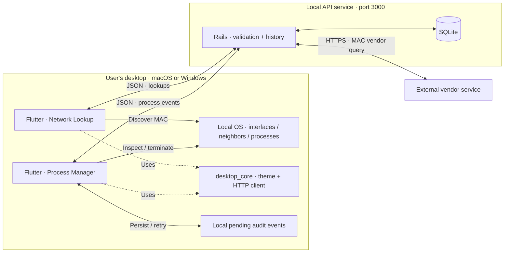

# Hudu Project

Two independent Flutter desktop apps with a shared Rails API: **Network Lookup** connects an IPv4 address to a locally discovered MAC and vendor; **Process Manager** inspects local processes and records confirmed terminations. This public take-home implements both options for macOS and Windows.

[](https://github.com/ConnorDykes/Hudu-Project/actions/workflows/ci.yml)

Both applications and the API are implemented. Local macOS checks are passing; hosted Windows builds and final delivery verification are in progress. See the [verification record](docs/verification-results.md) for the exact scope of completed checks.

## Application gallery

| Network Lookup | Process Manager |
| --- | --- |
|  |  |
| IPv4 → local MAC → vendor, with persisted history. | Local process inspection, confirmed termination, and audit history. |

*Actual Flutter UI rendered with synthetic sample data. [Preview provenance](docs/testing.md#screenshot-provenance).*

## Two options, independently runnable

| Capability | [Network Lookup](apps/network_lookup/) | [Process Manager](apps/process_manager/) |
| --- | --- | --- |
| Local operation | Validate IPv4; resolve MAC from local interfaces or ARP/neighbor data | List names and PIDs; sort, search, refresh |
| Main workflow | Send the discovered MAC to Rails for vendor lookup | Confirm the selected process identity, request termination, observe exit |
| Persisted history | Resolved, unknown-vendor, and provider-failure outcomes | Confirmed termination events with original occurrence time |
| Failure handling | Distinguish ARP miss, unknown vendor, API outage, and provider failure | Distinguish access denial, stale identity, unconfirmed exit, and audit failure |
| Convenience | Detect a primary active IPv4 address where available | Configurable auto-refresh; durable audit retry without repeating termination |

## Architecture



OS operations execute on the desktop client. Rails stores history and queries the external vendor service; it has no process-control endpoint. Each app runs without launching the other. The API is a separate service and is not embedded in either application bundle. See [Architecture](docs/architecture.md) and the canonical [API contracts](docs/contracts.md).

## Run locally

| Tool | Project version / prerequisite |
| --- | --- |
| Flutter | **3.47.2**, including its bundled Dart SDK |
| Ruby | **4.0.2** |
| Rails | **8.1.3.1**, installed through `bundle install` |
| macOS | Xcode and desktop dependencies; resolve relevant `flutter doctor -v` findings |
| Windows | Native Flutter and Visual Studio **Desktop development with C++**; Rails in WSL2 |
| Optional API container | Docker with Compose; keep Flutter on the native host |

Install the toolchains first; see [Development](docs/development.md) for platform setup, API configuration, and troubleshooting. These commands are the integration runbook; clean-clone verification is pending.

### macOS

In Terminal, clone and start the API:

```sh
git clone https://github.com/ConnorDykes/Hudu-Project.git
cd Hudu-Project
flutter --version
ruby --version
cd api
bundle install
bin/rails db:prepare
bin/rails server -b 127.0.0.1 -p 3000
```

Keep Rails running. In a second terminal at the repository root, run either app:

```sh
cd apps/network_lookup
flutter pub get
flutter run -d macos --dart-define=API_BASE_URL=http://127.0.0.1:3000
```

For Process Manager, use `apps/process_manager` in the same sequence. Check the API from another terminal with `curl --fail http://127.0.0.1:3000/health`.

### Windows + WSL2

Clone and run the Windows client in **PowerShell**, using native Windows Flutter:

```powershell
git clone https://github.com/ConnorDykes/Hudu-Project.git
Set-Location Hudu-Project
flutter doctor -v
Set-Location apps/network_lookup
flutter pub get
flutter run -d windows --dart-define=API_BASE_URL=http://127.0.0.1:3000
```

Start Rails first in a separate **WSL2 shell** with Ruby 4.0.2 installed. Use a Linux-side clone for its dependencies and database:

```sh
git clone https://github.com/ConnorDykes/Hudu-Project.git
cd Hudu-Project/api
bundle install
bin/rails db:prepare
bin/rails server -b 127.0.0.1 -p 3000
```

From PowerShell, verify connectivity with `Invoke-RestMethod http://127.0.0.1:3000/health`. Use `apps/process_manager` for the other app. [Development](docs/development.md#windows-native-client-rails-in-wsl2) covers WSL networking.

### Optional Docker API

With Docker and Compose running, replace native Rails startup with the following from the repository root:

```sh
docker compose up --build --wait api
docker compose logs api
```

Compose prepares SQLite, persists it in a named volume, and publishes only `127.0.0.1:3000`. Run Flutter on the native host as above. `docker compose down` stops the API while retaining history. Container execution is still pending verification.

The checked-in [developer scripts](scripts/README.md) also provide setup/check/run/build commands. For example, `bash scripts/dev.sh setup` then `bash scripts/dev.sh run network_lookup` on macOS; with Rails in WSL2 or Docker, use `./scripts/dev.ps1 setup flutter` then `./scripts/dev.ps1 run network_lookup` on Windows.

## Tests, builds, and downloads

Run `bundle exec rails test` from `api/`. From each app and `packages/desktop_core/`, run `flutter pub get`, `flutter analyze`, and `flutter test`. Run `flutter build macos --release` on macOS or `flutter build windows --release` on Windows from each app directory. These are commands to execute, not reported passing results.

The [test and build matrix](docs/testing.md) separates automated checks, native builds, integration, and manual UI evidence. [GitHub Actions](https://github.com/ConnorDykes/Hudu-Project/actions) and [Releases](https://github.com/ConnorDykes/Hudu-Project/releases) are the delivery destinations; successful runs and downloadable artifacts are **not yet verified**. Planned artifacts are unsigned development builds. Windows distribution requires the complete release folder, including its DLLs and data.

## Engineering choices and limits

- **Local IPv4 discovery:** ARP cannot identify a remote host's MAC across routers. An absent cache entry does not prove a device is offline. IPv6 discovery is outside the initial scope; VPNs and multiple adapters can make automatic address selection ambiguous.
- **Explicit writes:** `POST /lookups` performs and persists a lookup. The assignment's GET example is adapted because this operation creates history; `GET /lookups` reads history. See [API reference](docs/api.md).
- **Truthful process outcomes:** requesting termination is distinct from observing exit. Permissions and platform semantics apply. macOS PID-based signaling retains a race between identity validation and signaling.
- **Independent audit delivery:** after confirmed exit, a failed audit upload should be queued locally with a stable event ID. Retrying delivery must never terminate a process again. End-to-end recovery verification is pending.
- **Local service:** the API has no authentication. Bind it to loopback; this project does not provide a public hosted API, signed installers, notarization, or an App Store distribution claim.

## Documentation and AI collaboration

[Architecture](docs/architecture.md) · [API](docs/api.md) · [Development](docs/development.md) · [Testing](docs/testing.md) · [Verification results](docs/verification-results.md) · [AI development log](docs/ai-development.md)

The main agent owns contracts, shared infrastructure, integration, and review. Subagents implement the API, each desktop app, build tooling, and documentation in separate scopes. The [AI development log](docs/ai-development.md) records those factual responsibilities and distinguishes planned checks from supplied evidence. The banner is original vector artwork, not a Hudu corporate logo or an application screenshot.
