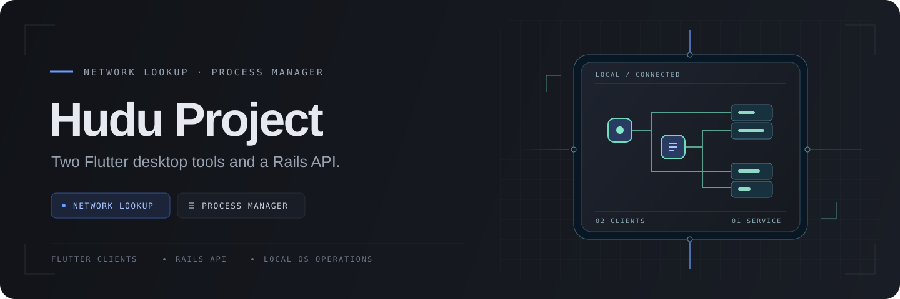
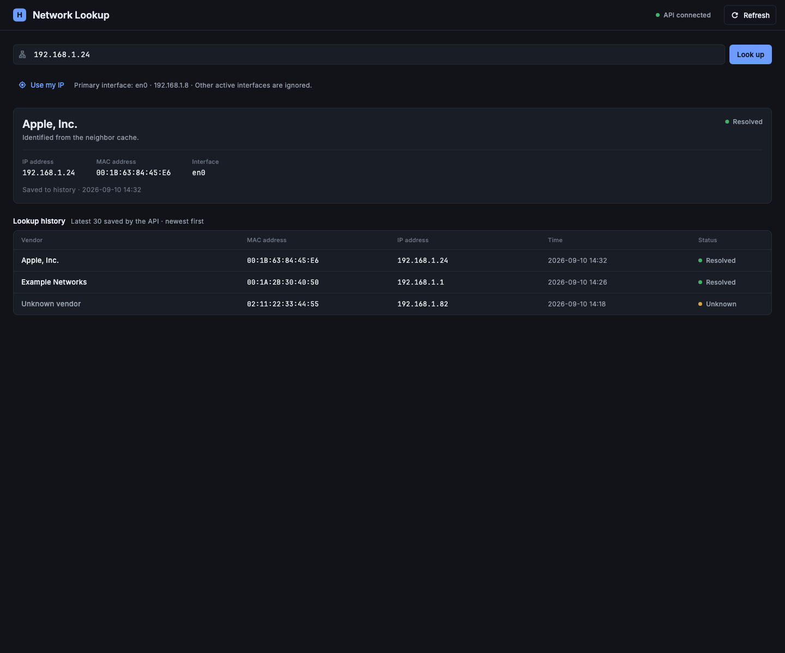
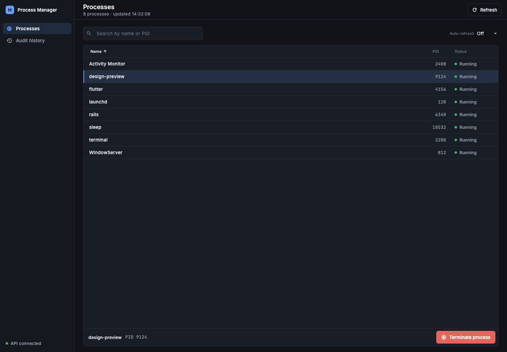
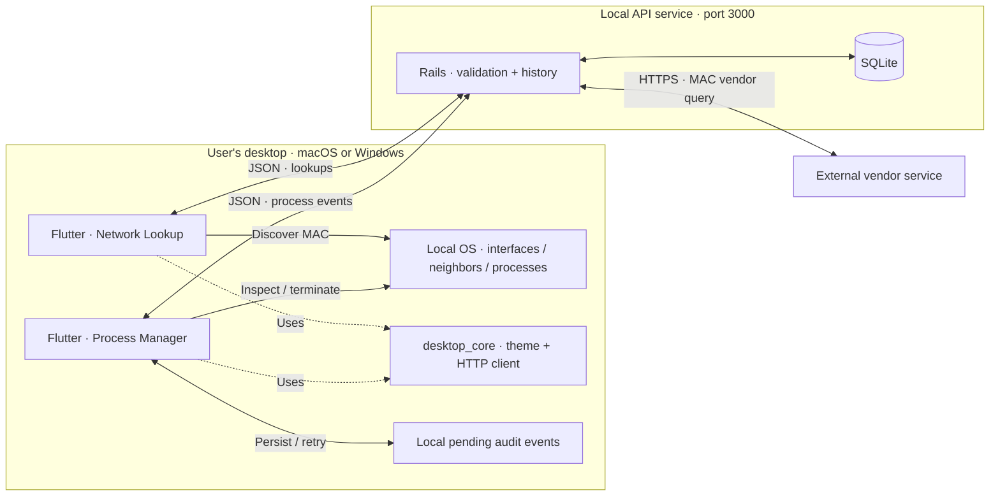

# Hudu Project

Two independent Flutter desktop apps with a shared Rails API: **Network Lookup** connects an IPv4 address to a locally discovered MAC and vendor; **Process Manager** inspects local processes and records confirmed terminations. This public take-home implements both options for macOS and Windows.

[](https://github.com/ConnorDykes/Hudu-Project/actions/workflows/ci.yml)

Both applications and the API are implemented, with native macOS and Windows CI builds. **90 Flutter tests and 40 Rails tests** pass in the documented local verification. See the [verification record](docs/verification-results.md) for exact evidence and limits.

## Application gallery

| Network Lookup | Process Manager |
| --- | --- |
|  |  |
| IPv4 → local MAC → vendor, with persisted history. | Local process inspection, confirmed termination, and audit history. |

*Actual Flutter UI rendered with synthetic sample data. [Preview provenance](docs/testing.md#screenshot-provenance).*

## Two options, independently runnable

| Capability | [Network Lookup](apps/network_lookup/) | [Process Manager](apps/process_manager/) |
| --- | --- | --- |
| Local operation | Validate IPv4; resolve MAC from local interfaces or ARP/neighbor data | List names and PIDs; sort, search, refresh |
| Main workflow | Send the discovered MAC to Rails for vendor lookup | Confirm the selected process identity, request termination, observe exit |
| Persisted history | Resolved, unknown-vendor, and provider-failure outcomes | Confirmed termination events with original occurrence time |
| Failure handling | Distinguish ARP miss, unknown vendor, API outage, and provider failure | Distinguish access denial, stale identity, unconfirmed exit, and audit failure |
| Convenience | Detect and use the primary active IPv4 address | Configurable auto-refresh; keyboard search, selection, and refresh; durable audit retry without repeating termination |

## Architecture



OS operations execute on the desktop client. Rails stores history and queries the external vendor service; it has no process-control endpoint. Each app runs without launching the other. The API is a separate service and is not embedded in either application bundle. See [Architecture](docs/architecture.md) and the canonical [API contracts](docs/contracts.md).

## Run locally

| Tool | Project version / prerequisite |
| --- | --- |
| Flutter | **3.47.2**, including its bundled Dart SDK |
| Ruby | **4.0.2** |
| Rails | **8.1.3.1**, installed through `bundle install` |
| macOS | Xcode and desktop dependencies; resolve relevant `flutter doctor -v` findings |
| Windows | Native Flutter and Visual Studio **Desktop development with C++**; Rails in WSL2 |
| Optional API container | Docker with Compose; keep Flutter on the native host |

Install the toolchains first; see [Development](docs/development.md) for platform setup, API configuration, and troubleshooting. macOS setup has been checked from a fresh public clone.

### macOS

In Terminal, clone and start the API:

```sh
git clone https://github.com/ConnorDykes/Hudu-Project.git
cd Hudu-Project
flutter --version
ruby --version
cd api
bundle install
bin/rails db:prepare
bin/rails server -b 127.0.0.1 -p 3000
```

Keep Rails running. In a second terminal at the repository root, run either app:

```sh
cd apps/network_lookup
flutter pub get
flutter run -d macos --dart-define=API_BASE_URL=http://127.0.0.1:3000
```

For Process Manager, use `apps/process_manager` in the same sequence. Check the API from another terminal with `curl --fail http://127.0.0.1:3000/health`.

### Windows + WSL2

Clone and run the Windows client in **PowerShell**, using native Windows Flutter:

```powershell
git clone https://github.com/ConnorDykes/Hudu-Project.git
Set-Location Hudu-Project
flutter doctor -v
Set-Location apps/network_lookup
flutter pub get
flutter run -d windows --dart-define=API_BASE_URL=http://127.0.0.1:3000
```

Start Rails first in a separate **WSL2 shell** with Ruby 4.0.2 installed. Use a Linux-side clone for its dependencies and database:

```sh
git clone https://github.com/ConnorDykes/Hudu-Project.git
cd Hudu-Project/api
bundle install
bin/rails db:prepare
bin/rails server -b 127.0.0.1 -p 3000
```

From PowerShell, verify connectivity with `Invoke-RestMethod http://127.0.0.1:3000/health`. Use `apps/process_manager` for the other app. [Development](docs/development.md#windows-native-client-rails-in-wsl2) covers WSL networking.

### Optional Docker API

With Docker and Compose running, replace native Rails startup with the following from the repository root:

```sh
docker compose up --build --wait api
docker compose logs api
```

Compose prepares SQLite, persists it in a named volume, and publishes only `127.0.0.1:3000`. Run Flutter on the native host as above. `docker compose down` stops the API while retaining history. CI exercises container startup, JSON requests, and persistence across restart.

The checked-in [developer scripts](scripts/README.md) also provide setup/check/run/build commands. For example, `bash scripts/dev.sh setup` then `bash scripts/dev.sh run network_lookup` on macOS; with Rails in WSL2 or Docker, use `./scripts/dev.ps1 setup flutter` then `./scripts/dev.ps1 run network_lookup` on Windows.

## Tests, builds, and downloads

Run `bundle exec rails test` from `api/`. From each app and `packages/desktop_core/`, run `flutter pub get`, `flutter analyze`, and `flutter test`. Run `flutter build macos --release` on macOS or `flutter build windows --release` on Windows from each app directory. See the [test and build matrix](docs/testing.md) for native smoke tests, real API integration, and packaging commands.

Download the [v1.0.0 development release](https://github.com/ConnorDykes/Hudu-Project/releases/tag/v1.0.0):

| App | macOS · Intel + Apple Silicon | Windows · x64 |
| --- | --- | --- |
| Network Lookup | [Universal app](https://github.com/ConnorDykes/Hudu-Project/releases/download/v1.0.0/hudu-network_lookup-macos-universal.zip) | [Complete Windows bundle](https://github.com/ConnorDykes/Hudu-Project/releases/download/v1.0.0/hudu-network_lookup-windows-x64.zip) |
| Process Manager | [Universal app](https://github.com/ConnorDykes/Hudu-Project/releases/download/v1.0.0/hudu-process_manager-macos-universal.zip) | [Complete Windows bundle](https://github.com/ConnorDykes/Hudu-Project/releases/download/v1.0.0/hudu-process_manager-windows-x64.zip) |

Start Rails before using API-backed features. macOS builds require macOS 12 or later. On Windows, extract the **entire** archive together and install the [Visual C++ x64 runtime](https://aka.ms/vs/17/release/vc_redist.x64.exe) if needed. These are development bundles without verified signing/notarization or installers; if platform security blocks a download, build from reviewed source rather than disabling system-wide protections. Native CI, artifact provenance, checksums, and manual-testing limits are recorded in the release notes and [verification record](docs/verification-results.md).

## Engineering choices and limits

- **Local IPv4 discovery:** ARP cannot identify a remote host's MAC across routers. An absent cache entry does not prove a device is offline. IPv6 discovery is outside the initial scope; VPNs and multiple adapters can make automatic address selection ambiguous.
- **Lookup endpoint:** `GET /lookups?mac=...` performs a lookup exactly as the brief illustrates; the desktop client uses the equivalent `POST /lookups` because the operation creates a history record. Plain `GET /lookups` reads history. See [API reference](docs/api.md).
- **Truthful process outcomes:** requesting termination is distinct from observing exit. Permissions and platform semantics apply. macOS PID-based signaling retains a race between identity validation and signaling.
- **Independent audit delivery:** confirmed exits are queued locally with a stable event ID. Delivery retries never terminate a process again. Recovery and retry behavior have automated tests; disk-write failures are explicit, and a crash between exit and durable persistence can still lose an event.
- **Local service:** the API has no authentication. Bind it to loopback; this project does not provide a public hosted API, signed installers, notarization, or an App Store distribution claim.

## Documentation and AI collaboration

[Architecture](docs/architecture.md) · [API](docs/api.md) · [Development](docs/development.md) · [Testing](docs/testing.md) · [Verification results](docs/verification-results.md) · [AI development log](docs/ai-development.md) · [Original plan](docs/implementation-plan.md)

The main agent owned contracts, shared infrastructure, integration, and delivery. Scoped subagents implemented the API, each desktop app, build tooling, and documentation; separate review agents checked the work. The [AI development log](docs/ai-development.md) records actual findings, corrections, and verification boundaries. The banner is original vector artwork, not a Hudu corporate logo or an application screenshot.
