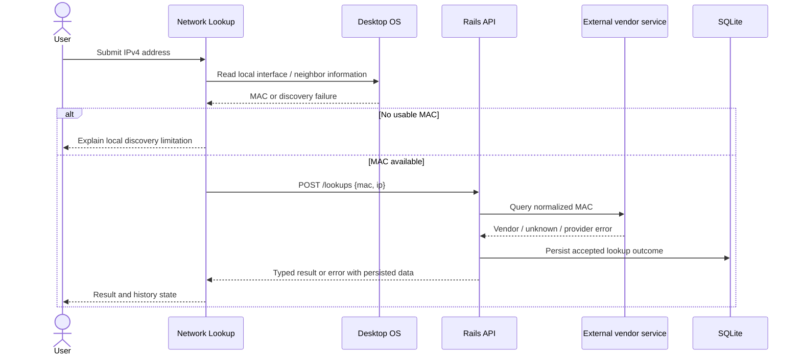
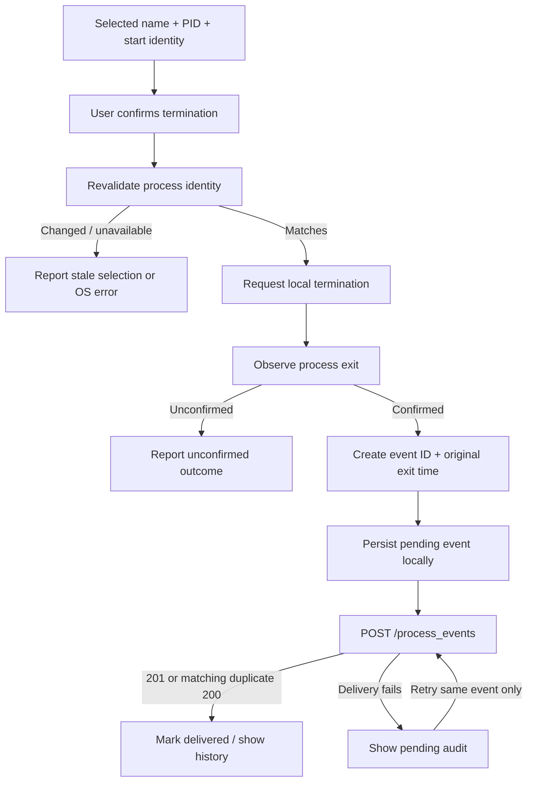

# Architecture

This document describes the agreed design while implementation and integration are in progress. [contracts.md](contracts.md) is canonical for wire behavior; [testing.md](testing.md) records verification status.

## Boundaries

| Component | Responsibility | Location |
| --- | --- | --- |
| Network Lookup | IPv4 input, local interface/neighbor discovery, vendor results, lookup history | `apps/network_lookup/` |
| Process Manager | Process inspection, selection and confirmation, local termination, audit queue and history | `apps/process_manager/` |
| Shared Flutter package | Common presentation components and injectable JSON transport | `packages/desktop_core/` |
| Rails API | Input validation, vendor adapter, lookup persistence, idempotent audit persistence, health | `api/` |
| SQLite | API lookup and process-event records | API-local `storage/` |
| External vendor service | Resolve a submitted MAC to a vendor label where available | HTTPS request from Rails |

The two Flutter apps are independent executables. Riverpod connects presentation to app-specific state and repositories; native adapters remain within their owning app. `desktop_core` shares theme, shell components, and `ApiClient`/`ApiException`, without owning either app's domain logic.

The client default is `http://127.0.0.1:3000`, read from compile-time `API_BASE_URL`. A different value requires rerunning or rebuilding the client. For Windows development, Flutter executes on Windows while Rails may execute inside WSL2. Containers host only the API. ARP and process information must still describe the desktop host.

## Lookup lifecycle

The API receives the MAC and optional IPv4 address; it does not discover the MAC remotely. Invalid API input produces no record. An ARP miss is also not persisted because there is no MAC to submit. Valid requests persist resolved, unknown, or failed provider outcomes. Unknown vendor is a completed lookup, distinct from a provider timeout or outage.

ARP applies to local IPv4 neighbors. The gateway MAC is not a remote host's MAC. A machine's own MAC may require local interface metadata because its own address need not appear in the ARP cache. Automatic address selection must account for multiple interfaces and VPNs. IPv6 neighbor discovery is outside the initial scope.

The current vendor adapter source uses a fixed `https://api.macvendors.com/` host with bounded request time and response size. Live-provider compatibility has not yet been verified. Availability and rate limits belong to the external service; deterministic tests should stub that boundary.

## Termination and audit lifecycle

This is the intended recovery flow; storage implementation and restart behavior require integration evidence. A retry is an HTTP delivery operation, never a second OS termination. A stable UUID makes retries idempotent. Rails returns an existing identical event with `200`, but rejects reuse of the ID with different attributes with `409 event_conflict`.

Process identity includes start/creation information because PIDs can be reused. Windows is intended to validate and terminate through the same process handle. macOS PID-based signaling retains a race after identity revalidation; it must not be described as race-free. Confirmation should identify the selected process, and reported success requires observed exit. Reject nonpositive and self PIDs, respect current-user permissions, and do not elevate or implicitly terminate trees. Platform implementations and native verification remain pending.

## Data and operating limits

The API's SQLite database persists accepted lookups and confirmed-exit audit reports. A process event is a client report, not independent server proof of an OS action. The local pending-audit store and the API database serve different purposes: one retains undelivered events, the other serves acknowledged history.

No authentication is configured. Loopback binding is the development boundary; remote exposure needs additional design. Vendor requests disclose the submitted MAC to the external provider. IPs, MACs, process names, and timestamps may be sensitive: use non-sensitive data for public demonstrations and keep local databases, logs, and credentials out of source control.

Both desktop platforms are targets, not a verification claim. The process manager is planned as an unsandboxed desktop utility; macOS entitlements and Finder-launched release behavior require review. Development artifacts are intended to be unsigned. Code signing, notarization, store submission, and a bundled API installer are outside the current delivery scope.
