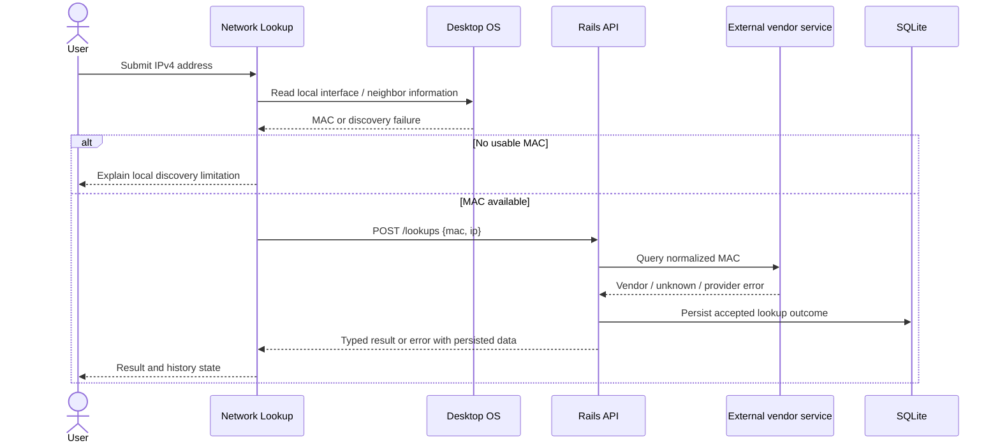
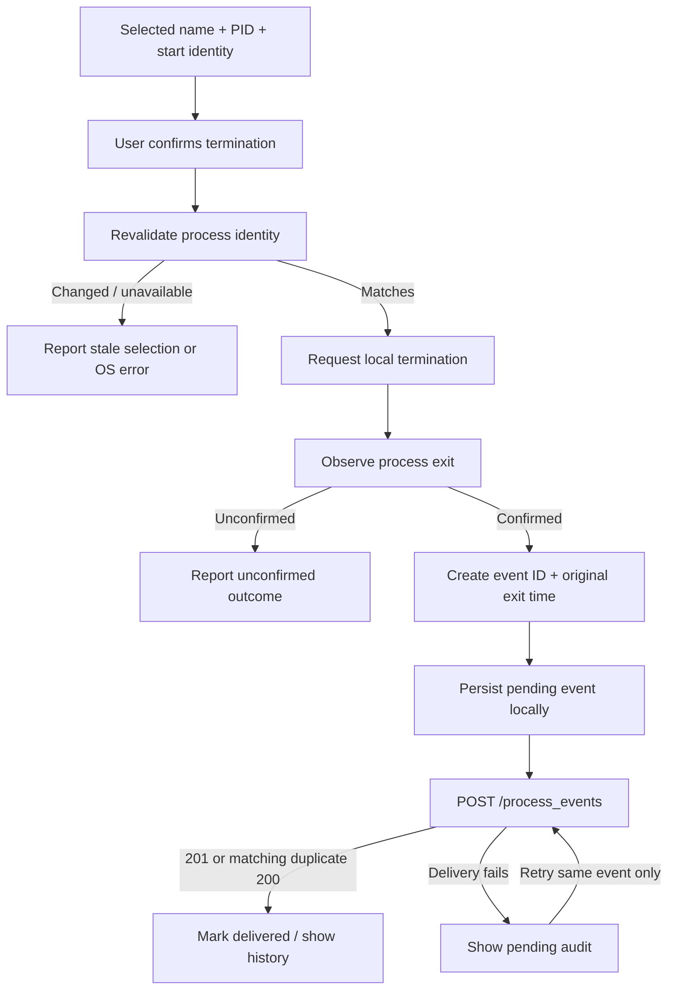

# Architecture

This document describes the implemented design. [contracts.md](contracts.md) is canonical for wire behavior; [verification results](verification-results.md) records execution evidence and limits.

## Boundaries

| Component | Responsibility | Location |
| --- | --- | --- |
| Network Lookup | IPv4 input, local interface/neighbor discovery, vendor results, lookup history | `apps/network_lookup/` |
| Process Manager | Process inspection, selection and confirmation, local termination, audit queue and history | `apps/process_manager/` |
| Shared Flutter package | Common presentation components and injectable JSON transport | `packages/desktop_core/` |
| Rails API | Input validation, vendor adapter, lookup persistence, idempotent audit persistence, health | `api/` |
| SQLite | API lookup and process-event records | API-local `storage/` |
| External vendor service | Resolve a submitted MAC to a vendor label where available | HTTPS request from Rails |

The two Flutter apps are independent executables. Riverpod connects presentation to app-specific state and repositories; native adapters remain within their owning app. `desktop_core` shares theme, shell components, and `ApiClient`/`ApiException`, without owning either app's domain logic.

The client default is `http://127.0.0.1:3000`, read from compile-time `API_BASE_URL`. A different value requires rerunning or rebuilding the client. For Windows development, Flutter executes on Windows while Rails may execute inside WSL2. Containers host only the API. ARP and process information must still describe the desktop host.

## Lookup lifecycle

The API receives the MAC and optional IPv4 address; it does not discover the MAC remotely. Invalid API input produces no record. An ARP miss is also not persisted because there is no MAC to submit. Valid requests persist resolved, unknown, or failed provider outcomes. Unknown vendor is a completed lookup, distinct from a provider timeout or outage.

ARP applies to local IPv4 neighbors. The gateway MAC is not a remote host's MAC. A machine's own MAC may require local interface metadata because its own address need not appear in the ARP cache. Automatic address selection must account for multiple interfaces and VPNs. IPv6 neighbor discovery is outside the initial scope.

The vendor adapter uses a fixed `https://api.macvendors.com/` host with bounded request time and response size. A live lookup and persisted response were verified separately from deterministic tests, which stub that boundary. Availability and rate limits belong to the external service.

## Termination and audit lifecycle

The outbox flushes each event to a temporary file before renaming it into the delivery queue, recovers interrupted writes on restart, and preserves corrupt files for investigation. Storage failures are displayed separately from network failures; an event held only in memory is never labeled saved locally. File-recovery and retry behavior have automated coverage. A retry is an HTTP delivery operation, never a second OS termination. A stable UUID makes retries idempotent. Rails returns an existing identical event with `200`, but rejects reuse of the ID with different attributes with `409 event_conflict`. There is an unavoidable crash gap between observing exit and durably writing the event; this is not an exactly-once OS-and-database transaction.

Process identity includes start/creation information because PIDs can be reused. Windows validates creation time and terminates through the same process handle. macOS sends SIGTERM after identity revalidation, retaining a PID race and the one-second resolution of the `ps` start timestamp. Confirmation identifies the selected process, and reported success requires observed exit. The adapters reject nonpositive and self PIDs, respect current-user permissions, and do not elevate or implicitly terminate trees. Native tests on both platforms terminate only harness-created children.

## Data and operating limits

The API's SQLite database persists accepted lookups and confirmed-exit audit reports. A process event is a client report, not independent server proof of an OS action. The local pending-audit store and the API database serve different purposes: one retains undelivered events, the other serves acknowledged history.

No authentication is configured. Loopback binding is the development boundary; remote exposure needs additional design. Vendor requests disclose the submitted MAC to the external provider. IPs, MACs, process names, and timestamps may be sensitive: use non-sensitive data for public demonstrations and keep local databases, logs, and credentials out of source control.

Both desktop platforms have native CI tests and release builds. The macOS apps run without App Sandbox so local OS discovery and process control remain available. The release bundles have no verified Developer ID signing or notarization; signing, store submission, and a bundled API installer are outside the delivery scope. Interactive Finder-launched and Windows GUI testing is not claimed; see the verification record.
